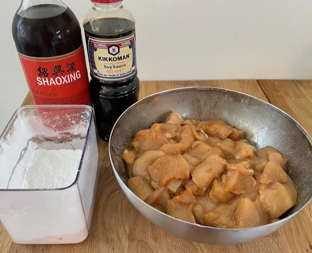

> Esivalmistelut: Aloita marinoimalla kana ja valmistamalla kastike.

## Marinadi

---

* `500g` kanaa sopivina paloina
* `1,5 rkl` soijakastiketta
* `1 rkl` Shaoxing-viiniä
* `2 rkl` maissitärkkelystä

> Marinoi kanaa vähintään vartti.

> 

## Kastike

---

* `1 rkl` mustaa riisiviinietikkaa
* `2 rkl` soijakastiketta
* `1 rkl` hoisin-kastiketta
* `1 rkl` paahdettua seesamiöljyä
* `1,5 rkl` sokeria
* `1 rkl` maissitärkkelystä
* `0,5 tl` sichuan-pippuria murskattuna
* `1 dl` vettä
* Inkivääriä raastettuna

>>> Voit halutessasi paahtaa sichuan-pippureita hetken kuivalla pannulla ennen murskaamista.

## Valmistus

---

* `1` paprika kuutioituna
* `2` sellerinvartta viipaloituna
* `¼ tl` suolaa
* `3` valkosipulinkynttä hienonnettuna
* `3` kevätisipulia renkaina (varret erikseen)
* `1 dl` paahdettuja suolattomia maapähkinöitä
* Ruokaöljyä

---

> Paista paprika ja selleri öljyssä suolan kanssa, poista pannulta.

---

> Paista marinoitu kana kahdessa erässä, poista pannulta.

---

> Freesaa valkosipulia ja kevätsipulia hetken ajan ja lisää ja esipaistetut asiat.

---

> Lisää kastike ja keittele kunnes se saostuu.

---

> Lisää paahdetut pähkinät ja kevätsipulin varret.
